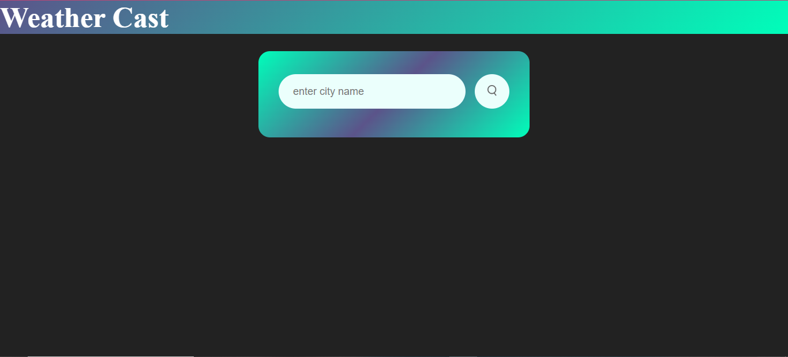
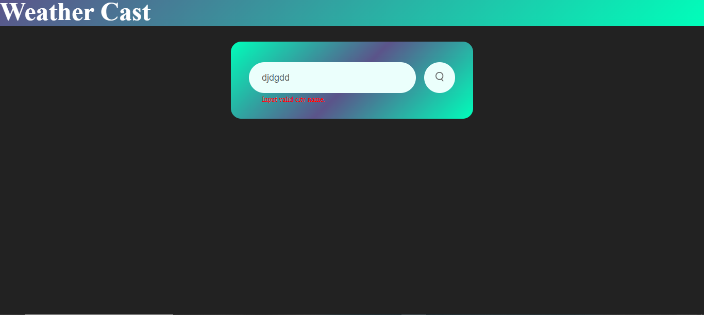
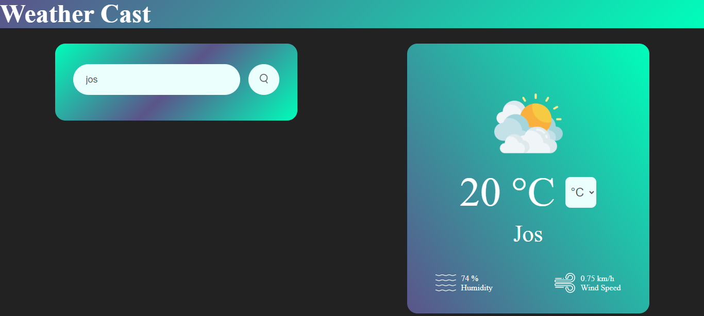

# weathercast
This is a simple weather app that enables you get the average weather condition of a city by simply searching the city's name. This app is program to display the average weather data of the basic weather elements vis: temperature(in celsius, kelvin and fareinheit), humidity(in percent-%) and windsspeed(in km/h).
Progressing, more features may be consider like ability to forecast weather for days, add more weather elements among other things to meet users need/demand.

## Features
**Current/Realtime Weather Report:** This app allow Users to check the current weather conditions, with the weather elements provided on the app to be: temperature, humidity and windspeed.

## Images

### inactive state
The below image shows the app in its inactive state.


### active: error state
The below image shows the app in its active state displaying error message indicating an error in the processing of request.


### active state
The below image shows the app in its active state displaying the various weather informations as requested.


## Getting Started

1. Clone the repository to your local machine:

   ```bash
   git clone https://github.com/tennjugu/Weather_App.git
   ```

2. Open the project folder in your favorite code editor.

3. Install webpack, wwebpack CLI and webpack config.

4. Locate the `index.html` file and open it in your web browser to use the Weather App.

## Usage

1. Upon opening the app, you will be presented with a form to input your city name.

2. On filling the form click the search button and your results will be fetched and displayed on the screen.

3. When a non existence city name is inputted or the submit search is clicked while the input field is empty, a query is displayed to alert you to input the a valid city name.

## API Key Disclaimer

Please be aware that the API key used in this project has been hidden. It will not be available for use or testing. In order to successfully use and interact with this Weather App, you must obtain your own API key from the respective service provider. I recommend following their official documentation to acquire the necessary credentials.

Please respect the terms of use and licensing agreements associated with the API key and use it responsibly. This project is intended for educational and informational purposes only.

Thank you for your understanding and cooperation.

To get an API key for a weather service provider, follow these steps:

1. Visit the website of a weather service provider (WeatherAPI).

2. Sign up for an account or log in if you already have one.

3. Generate an API key by following their API documentation.

4. Replace config.API_KEY in the JavaScript code with your own key.

```javascript
const myKey = config.API_KEY

```

5. Save the changes and retest the Weather App with your own API key.

## Contributing

This project is open for contributions. If you find any issues or have suggestions for improvements, feel free to open an issue or create a pull request.

## Acknowledgments

- The Odin Project for providing a comprehensive curriculum for web development.
- Weather service providers for offering weather data APIs.

## Built with
- JavaScript
- webpack
- HTML
- CSS
- Visual Studio Code
- Git & Github
---